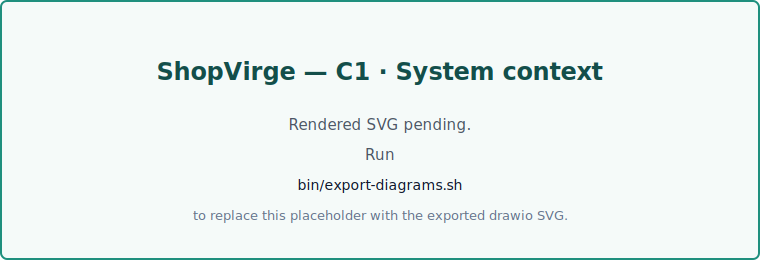
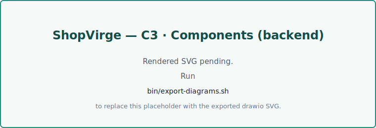
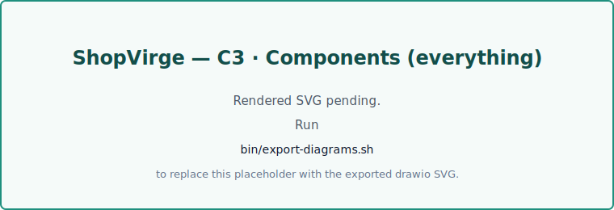

# C4 diagrams

The repository ships six [C4 model](https://c4model.com/) diagrams under `docs/diagrams/`. They're authored in [drawio](https://www.drawio.com/) and kept as the source of truth; the SVG renders embedded below are produced by `bin/export-diagrams.sh`.

!!! info "Regenerating SVGs"
    After editing any `.drawio` source, re-run the exporter from the repo root:

    ```bash
    bin/export-diagrams.sh
    ```

    The script calls the drawio desktop CLI. Install it from [drawio-desktop releases](https://github.com/jgraph/drawio-desktop/releases) (or `brew install --cask drawio` on macOS). The generated SVGs land in `docs/assets/diagrams/` and get embedded below. Commit both the updated `.drawio` source **and** the regenerated SVG.

!!! warning "Placeholder SVGs"
    Until `bin/export-diagrams.sh` has been run once on a machine with drawio installed, the images below are empty placeholders. The mkdocs build does not fail, and the `.drawio` source is always available for direct download via the link under each figure.

## C1 — System context

The system-in-its-environment view: what ShopVirge is, who uses it, and what external systems it talks to.



Source: [`docs/diagrams/ShopVirge_C1.drawio`](../diagrams/ShopVirge_C1.drawio)

## C2 — Containers

Deployable units (web app, API, database, third-party services) and how they communicate.


Source: [`docs/diagrams/ShopVirge_C2.drawio`](../diagrams/ShopVirge_C2.drawio)

## C3 — Components (backend)

The backend API broken into components: routers, CRUD, database layer, auth, email.



Source: [`docs/diagrams/ShopVirge_C3 BE.drawio`](<../diagrams/ShopVirge_C3 BE.drawio>)

## C3 — Components (frontend)

The frontend components from the same perspective.


Source: [`docs/diagrams/ShopVirge_C3_FE.drawio`](../diagrams/ShopVirge_C3_FE.drawio)

## C3 — Components (everything)

FE and BE components on a single canvas.



Source: [`docs/diagrams/ShopVirge_C3_Everything.drawio`](../diagrams/ShopVirge_C3_Everything.drawio)

## C4 — Code

The deepest C4 level: classes and code-level structures for the most interesting components.


Source: [`docs/diagrams/ShopVirge_C4_Everything.drawio`](../diagrams/ShopVirge_C4_Everything.drawio)
