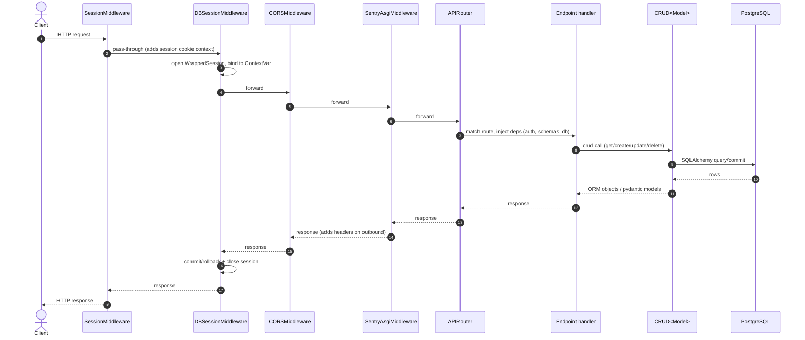

# Request flow

The middleware stack in `server/main.py` is (outermost first):

1. `SessionMiddleware` — signed session cookies.
2. `DBSessionMiddleware` — per-request SQLAlchemy session, scoped via `ContextVar`.
3. `CORSMiddleware` — configurable origins/methods/headers.
4. `SentryAsgiMiddleware` — forwards uncaught exceptions to Sentry.

Then the FastAPI router takes over and dispatches to an endpoint, which calls the CRUD layer, which talks to the database.

## Sequence diagram



## Transactions

A database session is opened per request and attached to a `ContextVar` so any code deeper in the stack — CRUD classes, utilities, background helpers — can grab the same session without threading it explicitly.

To run multiple operations atomically, use either the decorator or the context manager form defined in `server/db/database.py`:

=== "Decorator"

    ```python
    from server.db.database import transactional

    @transactional(db, logger)
    def complete_order(order_id: UUID) -> None:
        ...
    ```

=== "Context manager"

    ```python
    from server.db.database import transactional

    with transactional(db, logger):
        ...  # all writes committed on exit, rolled back on exception
    ```

The `WrappedSession` class wraps `sqlalchemy.orm.Session` with `autocommit=False` and `autoflush=True`; the middleware guarantees commit-on-success and rollback-on-exception semantics at request boundary.

## Startup hooks

`server/main.py` registers a FastAPI `lifespan` context that runs `alembic upgrade heads` on startup. This means pending migrations (across both the `schema` and `general`/data branches) are applied automatically when the server boots. See [Migrations](migrations.md) for details on the two-branch layout.
